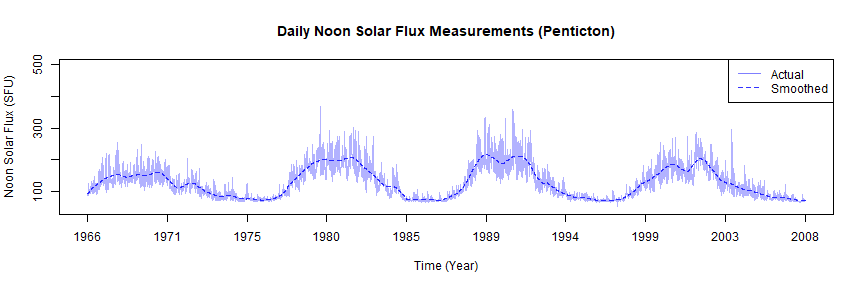

Time Series Interpolation Algorithms: Part 2
========================================================
author: Melissa Van Bussel
date: March 25th, 2019
autosize: false

Recall from last time...
========================================================

- A *time series* is a sequence of observations, $\{X_t\}$,  
one taken at each time $t$ and arranged in chronological order
- There are many methods available for modelling "nice" time series
- But...our data is not always nice

Goals of this Honours Project
========================================================
- Research a variety of interpolation algorithms
- Test the algorithms on real-world data
- Evaluate the performance of the algorithms using a 
number of performance criteria

So...what would you do?
========================================================
- Let's brainstorm!
- Consider the following example, which we will use for
the next few slides: 
$$
\{X_t\} = \{4, 7, 9, \text{NA, NA}, 6, 3, 5, \text{NA}, 12, 15\}
$$

- How would you fill in those points?

Some Notation
========================================================
- We denote $x$ as the original time series, and $X$ as the
time series after the missing points have been interpolated
- There are many different algorithms; we will discuss a handful of them, briefly

Some Terrible Methods
========================================================
$$
\{X_t\} = \{4, 7, 9, \text{NA, NA}, 6, 3, 5, \text{NA}, 12, 15\}
$$

- Replace all missing values with a randomly generated 
number between the minimum value and maximum value of the
series
- Replace all missing values with the mean of the non-missing
values (or median, or mode)

Slightly less terrible, but still terrible...
========================================================
$$
\{X_t\} = \{4, 7, 9, \text{NA, NA}, 6, 3, 5, \text{NA}, 12, 15\}
$$
- Last Observation Carried Forward 
- Next Observation Carried Backward
- Nearest Neighbor

$$
X_i = \begin{cases} 
      x_A & i < \frac{a+b}{2} \\
      x_B & \text{otherwise} \\
   \end{cases}
$$

Linear Interpolation
========================================================
- Let $x$ be the original time series. Let $X$ be the 
series after interpolation. Then the linear interpolation
algorithm is as follows: 
$$
X_i = \frac{x_A - x_B}{a -b}(i - b) + x_B
$$

Cubic Splines
========================================================
- For those of you that have taken 3180, this might be familiar!
- Cubic splines are interpolating polynomials
- Continuous cubic function connecting the endpoints of each sub-interval 
(piecewise defined)
- There are different "flavours" of cubic splines, based on boundary conditions

Kalman Filters
========================================================
- The Kalman Filter is also sometimes known as the LQE Algorithm
- Step 1: Prediction step (estimates, with their uncertainties)
- Step 2: Update step (outcome of next observation measured; 
higher certainty = higher weights)
- Apollo navigation computer

Moving Averages
========================================================
- A "window" is created around the missing value, and a 
weighted average is computed
- Simple, Linear Weighted, Exponential Weighted
- Points which are closer to the missing observation are 
weighted more heavily 

$$
\{X_t\} = \{4, 7, 9, \text{NA, NA}, 6, 3, 5, \text{NA}, 12, 15\}
$$

Moving Averages 
========================================================

Hybrid Wiener Interpolator
========================================================

- An interpolator invented by our very own Wesley Burr!
- Can be generally thought of as an "EM algorithm"
- Step 1: **Expectation** Step (the autocovariance function 
of the process is estimated)
- Step 2: **Maximization** Step (estimation of the missing
values, using the estimate of the ACVF)

How can we evaluate the performance?
========================================================
- Now that we've seen a handful of algorithms, we need a way
to see how well they perform. 
- $r, r^2$, absolute differences, MBE, ME, MAE, MRE, MARE, 
MAPE, SSE, MSE, RMS, NMSE, RMSE, NRMSD, RMSS...to name a few.
- Let's focus on a couple. 

Coefficient of Correlation
========================================================
- How closely related are $x$ and $X$? 
- Ranges from -1 to +1, where +1 represents a perfectly positive correlation
and -1 represents a perfectly negative correlation

$$
r = \frac{\sum_{i = 1}^n(X_i - \bar{X})(x_i - \bar{x})}{\sqrt{\sum_{i=1}^n(X_i - \bar{X})^2} \sqrt{\sum_{i=1}^n(x_i - \bar{x})^2}}
$$ 

Mean Square Error 
========================================================
- Commonly referred to as MSE 
- The sum of the squared errors, scaled by $n$: 

$$
\mathbf{MSE} = \frac{1}{n} \sum_{i = 1}^n (X_i - x_i)^2
$$

Testing Out the Algorithms 
========================================================
- 5%, 10%, 15%, 20%, 25% gaps imposed on 3 real-world datasets
(no missing observations originally)
- 18 different interpolation algorithms used on each one 
- 17 performance criteria for each 
- Created tables which display the algorithms that performed BEST, 
for each of the 17 criteria, for each of the algorithms and datasets
- Created tables which display the algorithms that performed WORST 
for each of the 17 criteria, for each of the algorithms and datasets

The Datasets Used
=======================================================
- The `airquality` dataset, temperature variable 
- Daily measurements of temperature (in Fahrenheit) 
in New York, May to September 1973

The Datasets Used
=======================================================
- The `sunspots` dataset
- Monthly mean relative sunspot numbers from 1749 to 1983

The Datasets Used
=======================================================
- The `flux` dataset, Penticton 
- Daily noon solar flux measurements from Penticton, 
British Columbia

Why these datasets?
========================================================
- Datasets are of varying length 
- Time intervals are varying 
- Non-Stationary
- And, being honest...my computer couldn't handle much more.

Results 
========================================================
- Example: "Best Performances" table for 20% gaps
- Need to demonstrate in RStudio 

Results
========================================================
- "Worst Performances" table for 20% gaps
- Need to demonstrate in RStudio

Results
=======================================================
- The algorithms that performed well performed very comparably 
- Example: correlation; 25% gaps
- Need to demonstrate in RStudio

Discussion of Results
=======================================================
- Some criteria (such as MBE) are ineffective / not useful 
- Replacing missing values with random numbers, means, medians,
or modes is a terrible idea (as expected)
- Exponential Weighted Moving Average and Kalman Filters 
performed particularly well 
- The algorithms which performed well performed VERY well,
and it was a close race
- Different algorithms will perform better for different time series

Next Steps 
======================================================
- Expand analysis to include more datasets (will
require more computational power)
- Experiment with varying gap lengths 
- Include datasets from a wide variety of fields

References
==========================================================

- Wesley S. Burr. Air Pollution and Health: Time Series Tools and Analysis. Queen's University, PhD thesis. 2012.

- Wesley S. Burr (2012). `tsinterp`: A Time Series Interpolation Package for `R`. R Package.

- Mathieu Lepot, Jean-Baptiste Aubin, and Francois H.L.R. Clemens. Interpolation in Time Series: An Introductive Overview of Existing Methods, Their Performance and Uncertainty Assessment. Water 2017, 9(10), 796.

- DataCamp. "Introduction to Time Series Analysis" and "ARIMA Modeling with R".

